# Python 프로그래밍 실습 환경 (Codespaces)

이 저장소는 **GitHub Codespaces**를 활용하여 별도의 복잡한 설치 과정 없이 웹 브라우저에서 즉시 Python 개발을 시작할 수 있도록 구성된 베이스 템플릿입니다.

## 1. GitHub 교육 계정 활성화

GitHub Codespaces를 무료로 더 많이 사용하기 위해 GitHub 교육 계정을 활성화하는 것을 권장합니다. 교육 계정을 활성화하면 Codespaces 사용 시간이 크게 늘어납니다.

1. **GitHub 교육 혜택 신청**: GitHub 메인 페이지에서 우측 상단의 프로필 아이콘을 클릭하고 **[Settings]** 를 선택합니다.

   

2. **교육 혜택 확인**: 설정 페이지에서 **[Billing and licensing]** > **[Education benefits]** 메뉴를 찾아 교육 혜택을 신청합니다. 학교 이메일 주소를 사용하여 인증을 완료하면 교육 계정이 활성화됩니다.

   인증이 된 상태

   

   인증이 되지 않은 상태

   

> **참고**: 교육 계정 인증은 보통 몇 시간에서 며칠 정도 소요될 수 있습니다. 인증이 완료되면 Codespaces 사용량이 증가합니다.

## 2. 실습 준비하기 (최초 1회)

1. **저장소 복제**: 상단의 **[Use this template]** -> **[Create a new repository]** 버튼을 클릭하여 본인의 GitHub 계정으로 저장소를 생성합니다.

   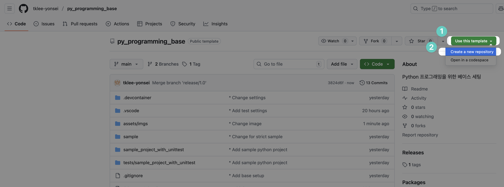

   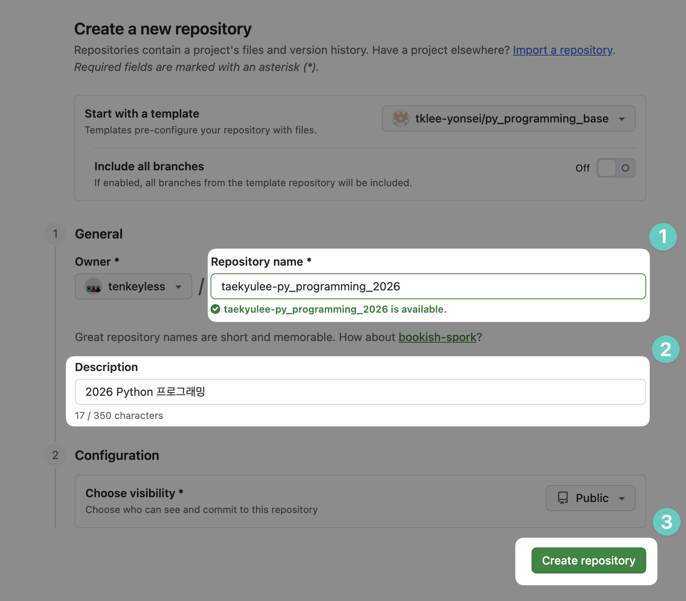

2. **Codespace 생성**: 생성된 본인의 저장소에서 **[<> Code]** 버튼 -> **[Codespaces]** 탭 -> **[Create codespace on main]** 을 클릭합니다.

   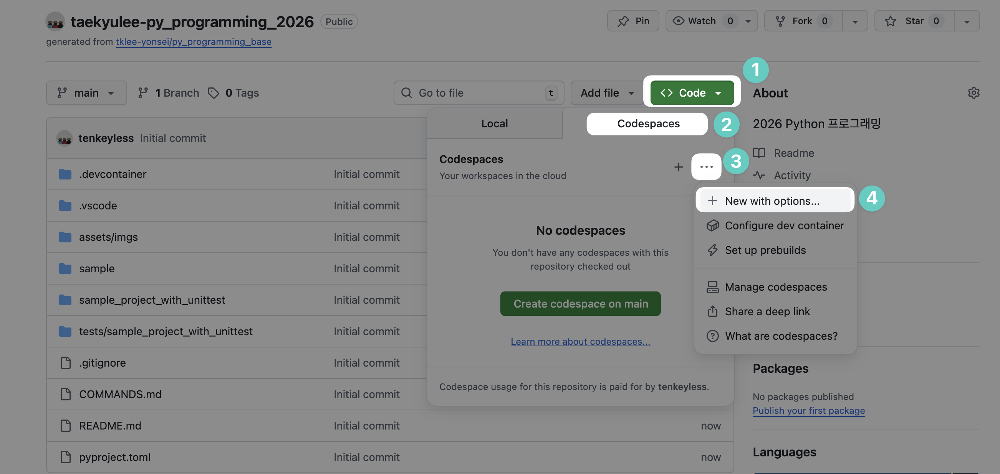

   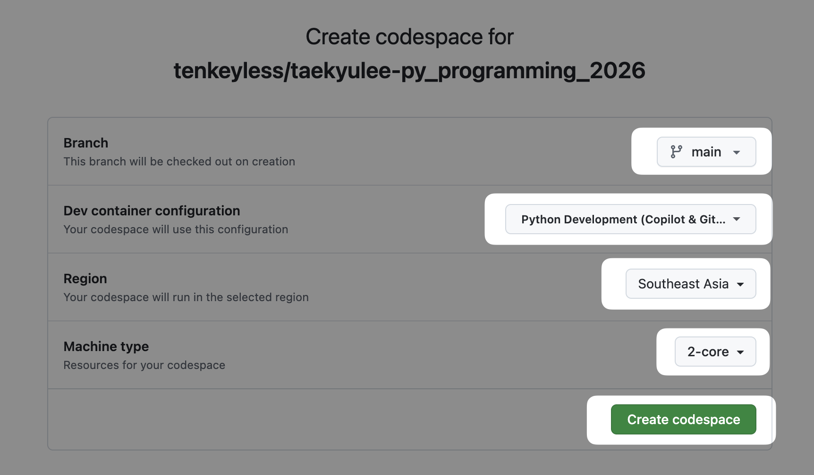

3. **환경 로딩**: 컨테이너 빌드가 완료될 때까지 약 1~2분 정도 기다립니다. VS Code 화면이 나타나면 모든 설정이 자동으로 완료됩니다.

## 3. 코드 작성 및 실행 방법

### 3.1 파일 생성 및 편집

- **파일 생성**: 왼쪽 탐색기에서 새로운 `.py` 파일을 만들거나 기존 파일을 수정합니다.

### 3.2 코드 포맷팅

코드 포맷팅은 `Black`을 통해 수행됩니다.

1. **수동 포맷팅**: 명령 팔레트(`F1` 또는 `Ctrl+Shift+P`)에서 **"Format Document"** 명령을 실행하거나 `Shift+Alt+F` (Windows/Linux) 또는 `Shift+Option+F` (Mac)를 눌러 포맷팅할 수 있습니다.

### 3.3 코드 실행 (Code Runner)

오른쪽 상단의 **재생 버튼(▶)** 또는 `Ctrl+Alt+N`을 누르면 하단 터미널에서 즉시 실행 결과가 나타납니다.

**실행 방식:**

- **단일 파일 실행**: `.py` 파일을 열고 재생 버튼을 누르면 `python3 -u` 명령으로 실행됩니다.
- **모듈로 실행**: 패키지 구조의 프로젝트는 터미널에서 `python -m 패키지명.모듈명`으로 실행합니다.

**예시:**

```bash
# 단일 파일 실행
python3 sample/sample.py

# 패키지 모듈로 실행
python -m sample_project_with_unittest.main
```

### 3.4 테스트 실행 (pytest)

pytest를 사용하여 유닛 테스트를 실행할 수 있습니다.

**테스트 탐색기 사용:**

1. 왼쪽 사이드바의 **플라스크 아이콘(테스트)** 을 클릭합니다.
2. 테스트 목록에서 실행하고 싶은 테스트를 선택하고 **재생 버튼(▶)** 을 클릭합니다.

**터미널에서 실행:**

```bash
# 모든 테스트 실행
pytest

# 특정 폴더의 테스트만 실행
pytest tests/sample_project_with_unittest/

# 상세 출력
pytest -v
```

### 3.5 코드 저장 및 업로드

작성한 코드를 GitHub에 저장하여 백업하고 다른 기기에서도 접근할 수 있습니다.

1. **원본 코드**: 코드를 수정하기 전의 원본 상태입니다.

   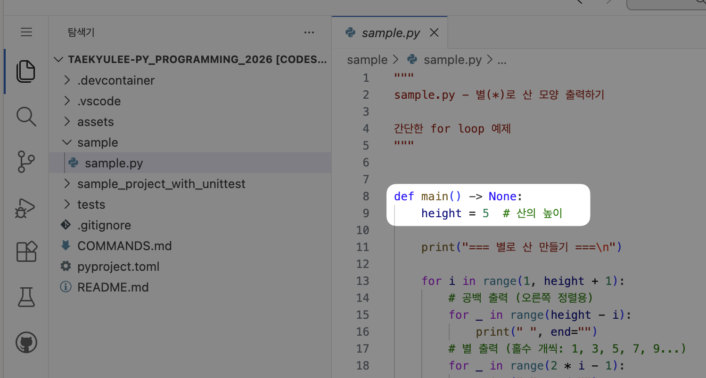

2. **코드 변경**: 파일을 수정하면 변경 사항이 생성됩니다.

   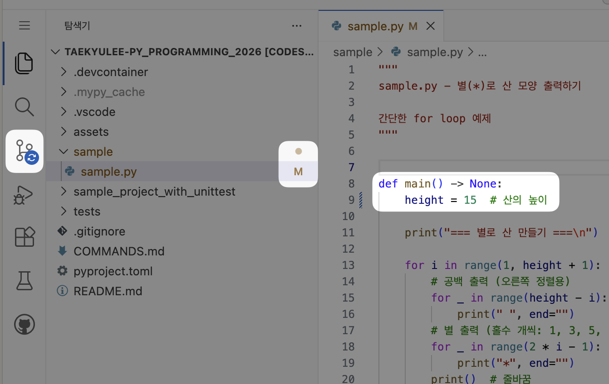

3. **소스 제어 탭으로 이동**: VS Code 왼쪽 사이드바의 **소스 제어** 아이콘(분기 모양)을 클릭하여 변경된 파일을 확인합니다.

   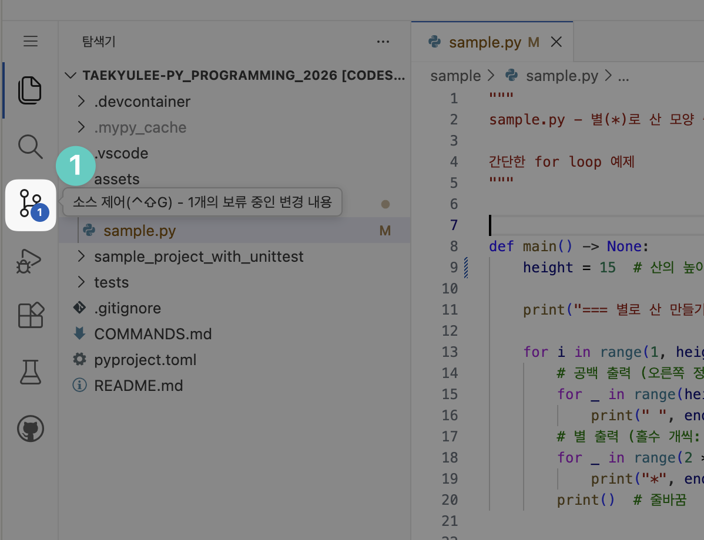

4. **변경 사항 스테이징**: 변경된 파일에 마우스 커서를 올리고 **+** 버튼을 클릭하여 스테이징 영역으로 이동시킵니다. 여러 파일을 동시에 업로드할 수 있습니다.

   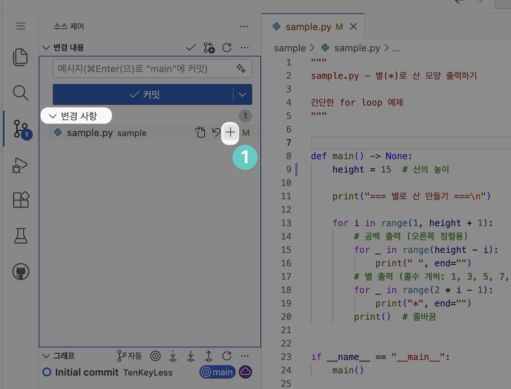

5. **커밋 메시지 작성 및 커밋**: 스테이징된 변경 사항이 위로 이동한 것을 확인할 수 있습니다. 상단의 메시지 입력란에 변경 사항에 대한 간단한 설명을 작성하고 (예: "새로운 함수 추가", "버그 수정" 등), **"Commit"** 버튼을 클릭하거나 `Ctrl+Enter` (Windows/Linux) 또는 `Cmd+Enter` (Mac)를 눌러 커밋을 생성합니다.

   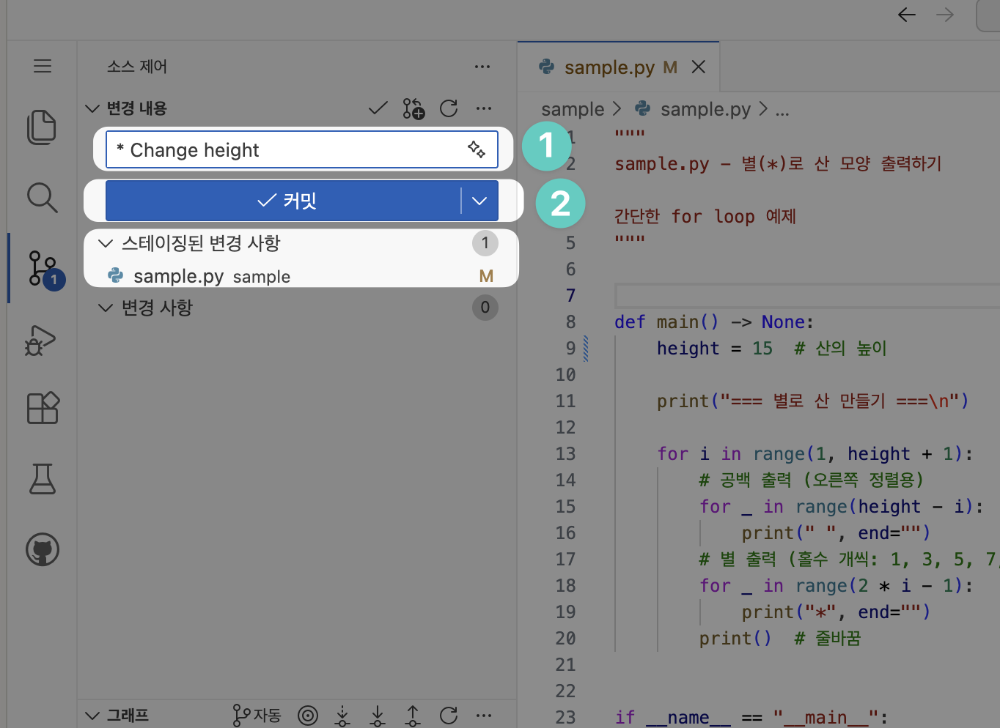

6. **원격 저장소에 푸시**: 그래프에서 변경 사항을 확인할 수 있습니다. **main**은 아직 업로드되지 않은 로컬 상태이고, **origin/main**은 온라인에 저장된 상태입니다. **"Push"** 버튼을 클릭하여 변경 사항을 GitHub에 업로드합니다.

   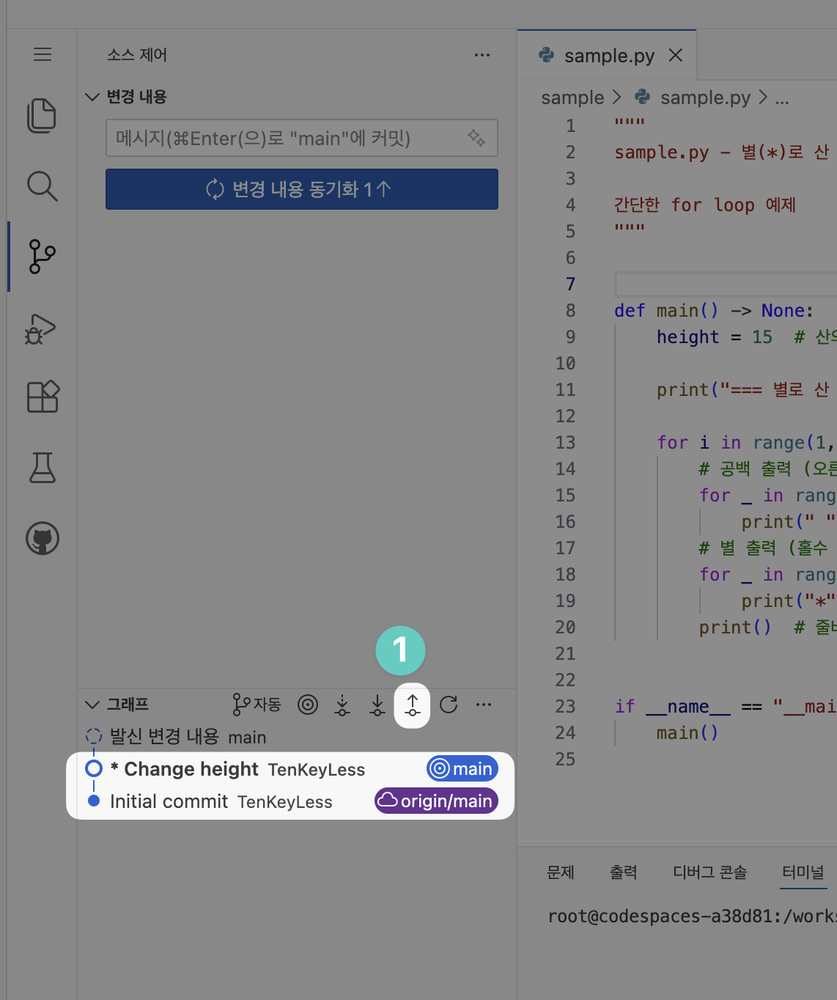

7. **푸시 완료**: 업로드가 완료되면 현재 상태(`main`)와 온라인 상태(`origin/main`)가 같은 위치에 있음을 확인할 수 있습니다.

   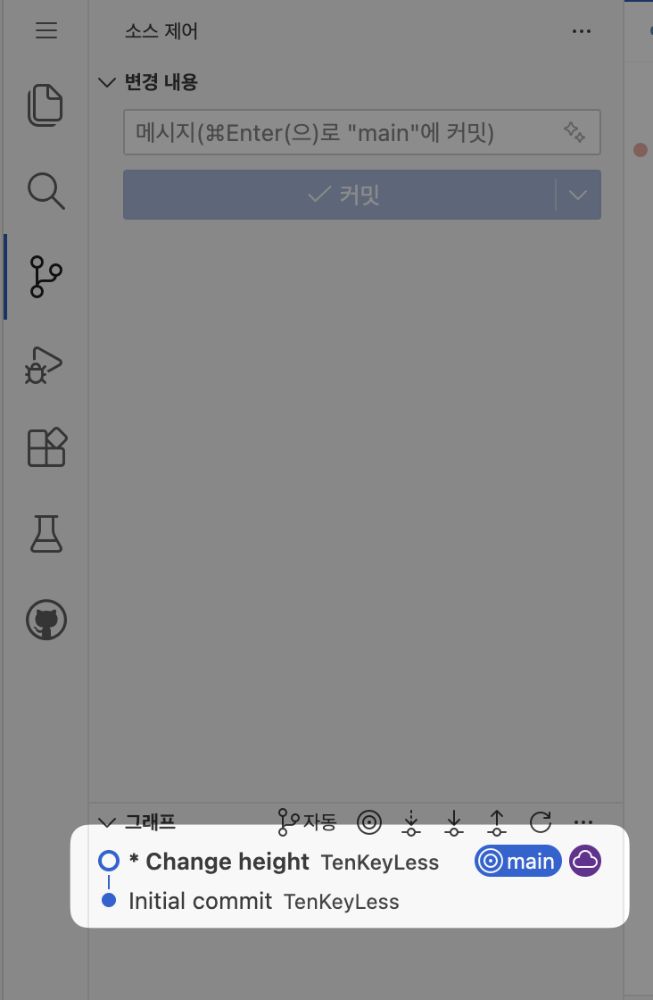

> **참고**: 초보자를 위한 간단한 워크플로우입니다. 팀 프로젝트나 더 체계적인 버전 관리가 필요한 경우 Git Flow(6.2 섹션 참조)를 사용하는 것을 권장합니다.

## 4. 주의사항 (무료 사용량 관리)

GitHub Codespaces는 매달 무료 사용 시간이 정해져 있습니다. 사용하지 않을 때는 반드시 종료해야 합니다.

### 4.1 컨테이너 종료

1. VS Code 왼쪽 하단의 **'Codespaces' (파란색 바)** 아이콘을 클릭합니다.
2. **[Stop Current Codespace]** 를 선택하여 실행을 중지합니다.
   - *단순히 브라우저 탭만 닫으면 일정 시간 동안 컨테이너가 계속 작동하여 시간이 차감될 수 있습니다.*
   - 기본 설정으로, 브라우저 탭을 닫을 시, 일정 시간 이후에 자동으로 컨테이너가 중지되지만, 그래도 되도록 **[Stop Current Codespace]** 로 종료하세요.

   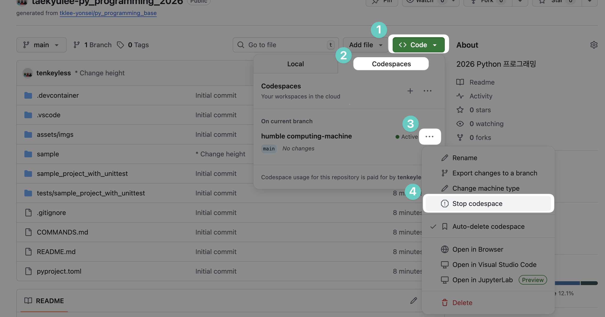

### 4.2 컨테이너 재시작

종료된 Codespace를 다시 시작하려면:

1. GitHub 저장소 페이지에서 **[<> Code]** 버튼을 클릭합니다.
2. **[Codespaces]** 탭에서 중지된 Codespace의 이름을 클릭합니다.

   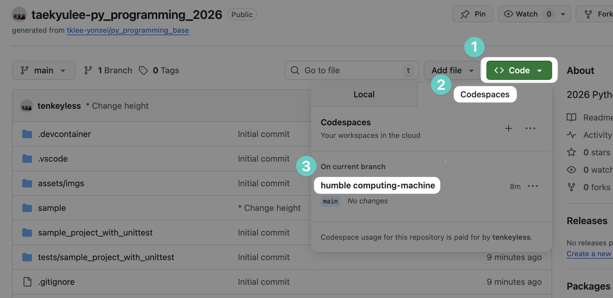

3. 종료 직후에는 "Stopping" 상태가 표시될 수 있습니다.

   

   이 경우 잠시 기다리면 "Restart" 버튼이 나타납니다.

   

## 5. 로컬에서 동일한 실습환경 만들기

로컬 컴퓨터에서 Codespaces와 동일한 개발 환경을 구성하려면 다음 도구들을 설치해야 합니다.

### 5.1 필수 도구 설치

1. **Docker Desktop 설치**
   - [Docker 공식 사이트](https://www.docker.com/get-started/)에서 Docker Desktop을 다운로드하고 설치합니다.
   - 설치 후 Docker Desktop을 실행하여 Docker가 정상적으로 작동하는지 확인합니다.

2. **Git 설치**
   - [Git 공식 사이트](https://git-scm.com/install/windows)에서 Git을 다운로드하고 설치합니다.
   - 터미널에서 `git --version` 명령어로 설치 확인이 가능합니다.

3. **Visual Studio Code 설치**
   - [VS Code 공식 사이트](https://code.visualstudio.com/)에서 Visual Studio Code를 다운로드하고 설치합니다.
   - VS Code 확장 프로그램에서 "Dev Containers" 확장을 설치합니다.

### 5.2 프로젝트 클론 및 실행

1. **프로젝트 클론**: 터미널에서 다음 명령어를 실행하여 프로젝트를 클론합니다.

   ```bash
   git clone <저장소_URL>
   cd py_programming_base
   ```

   실제 예제

   ```bash
   # user_account 부분은 본인 계정
   git clone https://github.com/user_account/py_programming_base.git
   # 혹은 ssh로
   git clone git@github.com:user_account/py_programming_base.git
   ```

2. **Docker Desktop 실행**: Docker Desktop을 실행하여 Docker가 정상적으로 작동하는지 확인합니다.

3. **프로젝트 폴더 열기**: VS Code에서 클론한 프로젝트 폴더(`py_programming_base`)를 엽니다.

4. **컨테이너에서 열기**: `F1` 키를 누르거나 `Ctrl+Shift+P` (Windows/Linux) 또는 `Cmd+Shift+P` (Mac)를 눌러 명령 팔레트를 엽니다. **"Dev Containers: Reopen in Container"** 명령을 선택합니다.

5. **환경 로딩**: 컨테이너 빌드가 완료될 때까지 약 1~2분 정도 기다립니다. VS Code 화면이 나타나면 모든 설정이 자동으로 완료됩니다.

## 6. 주요 도구 활용법

### 6.1 GitHub Copilot & Chat

1. **코드 추천**: 코드를 작성하면 Copilot이 회색 글씨로 다음 코드를 제안합니다. `Tab` 키를 눌러 수락하세요.
2. **AI 채팅**: 왼쪽 사이드바의 **말풍선 아이콘(Chat)** 을 클릭하여 문법 질문이나 에러 수정을 요청할 수 있습니다.

### 6.2 Git Flow (버전 관리)

1. **명령 팔레트 열기**: `F1` 키를 누르거나 `Ctrl+Shift+P` (Windows/Linux) 또는 `Cmd+Shift+P` (Mac)를 눌러 명령 팔레트를 엽니다.

   

2. **터미널 토글 선택**: 터미널을 엽니다.

   

3. **열린 터미널**: 터미널이 열립니다.

   

4. **새 터미널 만들기**: 새 터미널을 만듭니다.

   

5. **Git Flow init 및 업로드**
   - `git flow init`을 실행하고, 나오는 항목은 그냥 엔터로 넘깁니다.
   - 이후 업로드합니다.

   

6. (참고) 변경 사항
   - 이 명령으로 인해, GitHub 저장소로 가보면, 새로운 Branch가 만들어져 있고,
   
   - Codespace도 On other branches로 옮겨져 있습니다.
   

### 6.3 Git Flow (버전 관리) 자주 사용하는 명령

수업 중 기능 단위 개발을 위해 Git Flow를 사용합니다. 자주 사용하는 명령어는 [COMMANDS.md](COMMANDS.md) 문서에서 복사-붙여넣기로 사용할 수 있습니다.

> **참고**: 자세한 명령어 목록은 [COMMANDS.md](COMMANDS.md)를 참조하세요.

## 7. 포함된 개발 환경

1. **OS**: Ubuntu Latest (Python 3.14 slim)
2. **Python**: Python 3.14
3. **Tools**: pip, black, pylint, pytest
4. **VS Code Extensions**: Python, Pylance, Black Formatter, Code Runner, GitHub Copilot

## 8. 샘플 프로젝트 참고사항

저장소에 포함된 샘플 프로젝트들의 구조와 사용법입니다.

### 8.1 sample/

단일 파일 프로젝트 예제입니다.

- **테스트 없음** - 간단한 실습용
- Code Runner로 직접 실행하면 `python3`로 실행됩니다.

```bash
python3 sample/sample.py
```

### 8.2 sample_project_with_unittest/

여러 파일 + **pytest 테스트** 프로젝트 예제입니다.

```bash
# 메인 프로그램 실행
python -m sample_project_with_unittest.main

# 테스트 실행
pytest tests/sample_project_with_unittest/ -v
```

**프로젝트 구조:**

```text
py_programming_base/
├── sample_project_with_unittest/
│   ├── __init__.py            # 패키지 초기화 파일
│   ├── calculator.py          # 계산 함수
│   ├── display.py             # 출력 함수
│   └── main.py                # 메인 프로그램
└── tests/
    └── sample_project_with_unittest/
        ├── test_calculator.py # calculator 유닛 테스트
        └── test_display.py    # display 유닛 테스트
```
